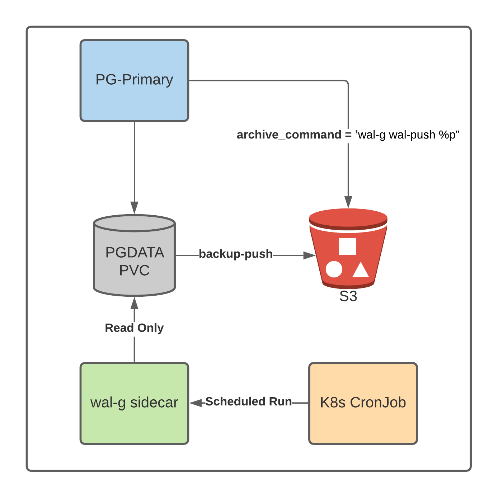

## Backup for EDB Postgres on Kubernetes 

The EDB Postgres Operator (edb-operator) simplifies backup and recovery of PostgreSQL and EDB Postgres Advanced Server clusters in Kubernetes. Backups are simply part of a deployment and can be configured and subsequently updated through the Kubernetes Custom Resource of a deployment.

Adding the two backup parameters under the `walgConfig` spec enables backup jobs to run from a sidecar container on the defined schedule: 

```
walgConfig:
    enableWalg: true
    walgSecret: "walg-aws-secret"
    walgPrefix: "s3://<S3_bucket_here"
    regionAWS: "us-east-2"
    backupRetentionPolicy: 3
    backupSchedule: "0 0 * * *"
```
## Backup Architecture

Two things are needed to restore a PostgreSQL backup: Full backup (base) and WAL files to restore to a point past when the Full backup was taken (latest being the default and most common option). Full backups must be scheduled outside of PostgreSQL, a sidecar runs on the defined schedule to take full backups run. Restoring to a point after the full backup requires the `archive_command` be configured on the Primary Database container to automatically push WAL files to a storage location when a WAL file is full and switched or archive_timeout is exceeded. A `restore_command` is needed during recovery to fetch the WAL files from a storage location and restore the latest changes before the database server is available.



## Example: Keeping 3 full backups on Amazon S3 using the Kubernetes secret - walg-aws-secret. 

Create a secrets file for your target storage provider. In this example, we are using an S3 secret with the following 3 lines and the Kubernetes Secret name walg-aws-secret (used below in our deployment CR): 

```
[default]
aws_access_key_id=<s3 access key id> 
aws_secret_access_key=v<aws secret access key> 
```

Example CR for a deployment that automatically adds backup and recovery capabilities to K8s via wal-g sidecar:  


```
 walgConfig:
   enableWalg: true
   walgSecret: "walg-aws-secret"
   walgPrefix: "s3://${bucket_name}/${folder_name}"
   regionAWS: "us-east-2"
   backupRetentionPolicy: 3
   backupSchedule: "0 0 * * *"
 primaryConfig:
   archive_mode: "on"
   archive_command: "wal-g wal-push %p"
```

After the deployment, verification can be done by checking the `pg_stat_archiver` table in PostgreSQL and also checking the target S3 bucket. The example below shows connecting to PostgreSQL using the psql client and verifying the `archive_command`, forcing a WAL file switch which in turn calls the `archive_command`, and then verifying the `pg_stat_archiver` catalog table. 


```
edb=# show archive_command;
                 	archive_command                	 
---------------------------------------------------------
wal-g wal-push %p

edb=# select pg_switch_wal();
 pg_switch_wal
---------------
 0/90000E8

edb=# select archived_count, failed_count from pg_stat_archiver;
 archived_count | failed_count
----------------+--------------
         	10 |        	0
```
