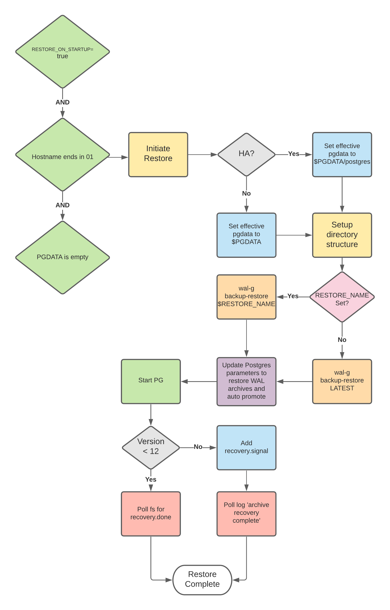

## Database Restore for EDB Postgres on Kubernetes

Restoring to a full backup taken the edb-operator or any full PostgreSQL backup taken with wal-g can be performed with just a few parameters in the Kubernetes CustomResource at the time of deployment. Valid wal-g values for Amazon S3 are required.

## Restore Process Flow

The decision flow process below is used during the database restore process. These are the initial checks to initiate a database backup restore:

* Verify `restoreOnStartup` is set to `true`
* Verify restore happens on the first Pod in a StatefulSet (*01) 
* Verify `PGDATA` is empty (PVC could be reused mistakenly)



## Restore Spec


|       Parameter        |                                                                                                                                                                  Note                                                                                                                                                                 |
|:----------------------:|:-------------------------------------------------------------------------------------------------------------------------------------------------------------------------------------------------------------------------------------------------------------------------------------------------------------------------------------:|
| enableWalg             | Required: Both backup and restore currently rely on wal-g                                                                                                                                                                                                                                                                             |
| walgSecret walgPrefix  | Required: These two parameters are required by wal-g to communicate with Amazon S3 to push & pull backups. These parameters would also be required if the storage option was Azure Storage or Google Cloud Storage (the input would need to be parsed to differentiate between WALG_S3_PREFIX (Amazon)  and WALG_GS_PREFIX (Google) .  |
| regionAWS              | Optional: Specific to configuring wal-g to communicate with Amazon S3. This parameter eliminates a round trip communication every time wal-g needs to communicate with S3 to determine which region the S3 bucket is in. .                                                                                                            |
| restoreOnStartup       | Optional: Setting this to true sets the initialize path to pull a base backup copy of Postgres rather than initializing a new cluster                                                                                                                                                                                                |
|      restoreBackupName | Optional. By default, the backup restore will look for the latest base backup in the Amazon S3 bucket unless you provide a named backup. This option would be used to restore an older backup.                                                                                                                                     |

## Sample CR with Restore configured

```
walgConfig:
   enableWalg: true
   walgSecret: "walg-aws-secret"
   walgPrefix: "s3://foo/bar"
   regionAWS: "us-east-2"
   restoreOnStartup: true
   restoreBackupName: "LATEST"
```
